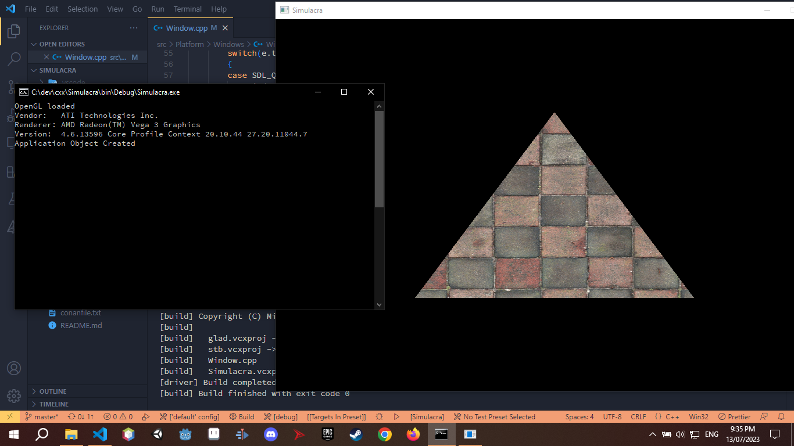

# Simulacra

A in-house rendering engine for the implementation of rendering algorithms specified in the PBR book.

Personally used for game development, visualizing data, and algorithms.



# Installation

```
$ mkdir build
$ cd build
$ conan install .. --ouptput-folder=build --profile=<debug_profile> --build=missing
```


### Roadmap
- [ ] Multi-threading
- [ ] Networking
- [ ] Profiler & Built-in Debugger 
- [ ] Physics Engine

# References

* [Physically Based Rendering: From Theory to Implentation](https://www.pbr-book.org/)