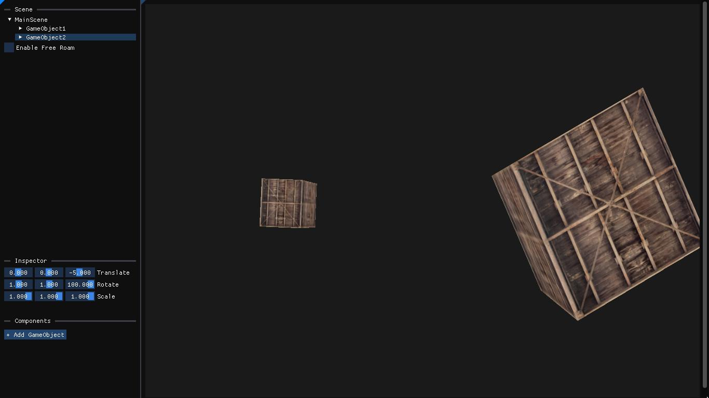

# Simulacra

A in-house rendering engine for the implementation of rendering algorithms specified in the PBR book.

Personally used for game development, visualizing data, and algorithms.



# Installation

## Prerequisites
* **[Conan](https://conan.io/downloads)**
* **[CMake](https://cmake.org/download/)**

## Required IDEs / Compilers
* **[Visual Studio Community / MSVC](https://visualstudio.microsoft.com/downloads/)**
* **[GCC](chatgpt.com/?oai-dm=1)**

## Conan 2.0
```console
# conanfile.txt
conan install . --output-folder=build --settings=build_type=Debug --build=missing

# or

# conanfile.py
conan install . --settings=build_type=Debug --build=missing

```

## Prior to Conan 2.0
<debug_profile> is the conan profile set to debug mode

```console
mkdir build
cd build
conan install .. --ouptput-folder=build --profile=<debug_profile> --build=missing
```

## Building and running the project

### Terminal / Console
```console
cmake -DCMAKE_TOOLCHAIN_FILE=<path-to-conan_toolchain.cmake> -S . -B build
cmake --build build


# Windows Example

# Values: 
# <build_config> - Debug, Release

cmake -DCMAKE_TOOLCHAIN_FILE=build/generators/conan_toolchain.cmake -S . -B build
cmake --build build
cd bin/<build_config>
Sandbox.exe # to run the program
```

### VSCode 
1. If the appropriate cmake tools didn't exist. Install the CMake and CMake Tools extension first.
2. Follow the conan installation procedure.
3. CTRL + SHIFT + P and search for CMake: Configure in the command palette
4. Then build (F7) or debug (CTRL + F5)
 

### Roadmap
- [ ] Multi-threading
- [ ] Networking
- [ ] Profiler & Built-in Debugger 
- [ ] Physics Engine

# References

* [Physically Based Rendering: From Theory to Implentation](https://www.pbr-book.org/)
